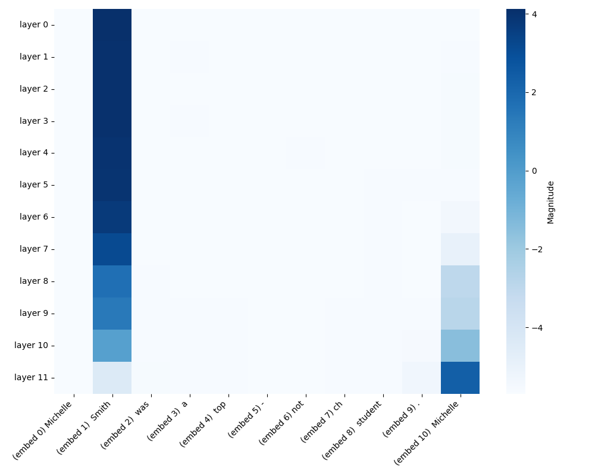

# minGPT-Insights

## Overview

This project extends Karpathy's minGPT to explore mechanistic interpretability in transformer models. It implements activation patching techniques to analyze how specific embeddings influence GPT-2's text generation, providing insights into the model's decision-making process.

## Features

- **Activation Patching**: Intervene in model activations by replacing corrupted embeddings with clean ones to assess their impact on output predictions.
- **Heatmap Visualization**: Generate heatmaps to visualize the significance of different embeddings across model layers and tokens.

## Requirements

- Python 3.8 or higher
- Dependencies listed in `requirements.txt`

## Usage

1. **Clone the Repository**:
   ```bash
   git clone https://github.com/your-username/minGPT-Insights.git
   cd minGPT-Insights
   ```

## Experiment Details
The interpretability.py script compares pairs of texts differing by a single token and analyzes how embedding patches affect GPT-2's predictions.

- **Clean Input:**
"Michelle Jones was a top-notch student. Michelle"
- **Corrupted Input:**
"Michelle Smith was a top-notch student. Michelle"

The script analyzes how the embedding of "Jones" versus "Smith" influences GPT-2's predictions for the token following "Michelle." The output differences across layers and embeddings are visualized as a heatmap.

Here is a sample heatmap generated from this experiment:

### Explanation:

This heatmap visualizes the activation patching process applied to the example "Michelle Smith was a top-notch student. Michelle". It shows the magnitude of logit differences when clean embeddings are patched into the corrupted input.

The X-axis represents the input tokens (embeddings) from the sequence, while the Y-axis represents the GPT-2 transformer layers. The intensity of the color indicates the magnitude of the patched embeddings' influence. For instance, we observe significant changes in the embeddings of "Smith" (embed 1) and the second "Michelle" (embed 10) across early and middle layers, suggesting these positions are critical for the model's decision-making when resolving the prediction influenced by "Smith" versus "Jones."



## References
- [Assignment on Mechanistic Interpretability of Transformers](https://jaspock.github.io/tpln2425/assignment-interpretability/)
- [Karpathy's minGPT Repository](https://github.com/karpathy/minGPT)